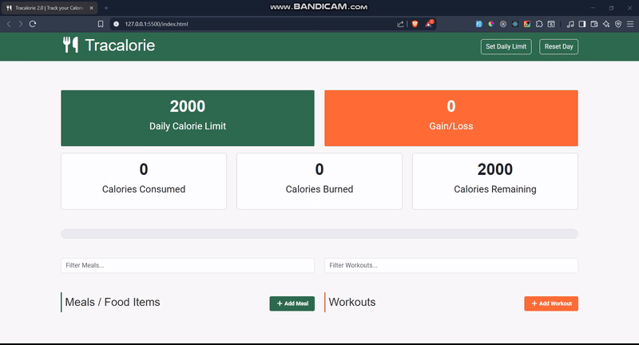

# 🥗 Tracalorie

A simple yet powerful **calorie tracking app** built with **HTML, CSS, Bootstrap, and JavaScript (OOP)**.  
It allows users to set a daily calorie limit, track meals and workouts, and visualize progress with a clean UI and data persistence.

## 🎥 Demo



## 💡 Features

- ✅ Set a **daily calorie limit**
- 🔄 Reset the day anytime
- 🍔 **Add, delete, and filter meals**
- 🏋️ **Add, delete, and filter workouts**
- 📊 Display calorie stats (limit, consumed, burned, gain/loss, remaining)
- 📈 Interactive **progress bar**
- 💾 **LocalStorage persistence** (data saved between sessions)

## 🛠️ Tech Stack

  
  
  
  
  


## 🚀 Getting Started

1. Clone the Repository
   ```bash
   git clone https://github.com/Umairulislam/tracalorie-app.git
   cd tracalorie-app
   ```
2. Open `index.html` in your web browser or use a live server extension.
3. Start tracking your calories!

## 👨‍💼 Author

Crafted with care by **Engr. Umair Ul Islam**
